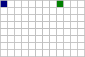
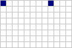
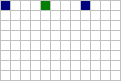
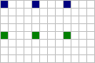
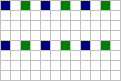
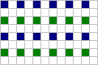
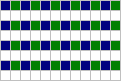
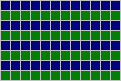
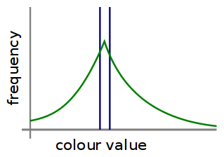
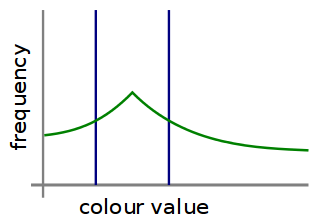

# RSIC

RSIC is an in-development image compression algorithm focused on compression ratio. Currently, it only operates in a lossless mode and on a single colour channel.

Some of the techniques involved are recursive subdivision and multi-variable statistical modeling.

Development is currently focused on single channel compression. Multiple channel support and lossy compression are planned.

## Compression with recursive subdivision

Write image dimensions and top-left pixel colour value.

The rest of the pixels are encoded in layers, going from the layer with the highest index down to the layer with index 1. Each layer has a corresponding scale defined as 2^layer.index. The scale is the gap between encoded pixels in the first stage of each layer.

The highest layer.index is the one with the highest scale that still encodes pixels within the image's dimensions, it can be calculated by:

floor(log2(max(image.width, image.height) - 1))

For each layer, follow these steps:

1. Compress the pixels at (scale/2 + n*scale, m*scale), where n and m are natural numbers, this corresponds with the horizontal midpoint of pixels calculated in previous layers.
2. Compress the pixels at (n*scale/2, m*scale), where n and m are natural numbers, this corresponds with the vertical midpoint of calculated in previous layers, as well as the pixels calculated in the previous step.

The following list is an example of the progression of layers in an image. Blue pixels are those that have been encoded previously and can be used as input for encoding. Green are pixels which are being encoded.

4. Scale 16. The vertical encode step for this layer has no pixels within the image dimensions.

    
3. Scale 8.

    
2. Scale 4.

    
1. Scale 2.

    

In practice, the small number of pixels in the higher indexed layers means they offer little potential for compression, so several may be skipped.

## Encoding pixels

Encoding pixels is done by generating a statisical distribution to predict the pixel's value based on known surrounding pixels. Additional information may be included in the compressed file to improve the accuracy of these distributions. Here are some examples of what kind of distribution might be formed based on the values of the closest 2 pixels (the blue lines represent the known surrounding pixel values):

 

These distributions are used with a technique called [arithmetic or range encoding](https://en.wikipedia.org/wiki/Arithmetic_encoding).
